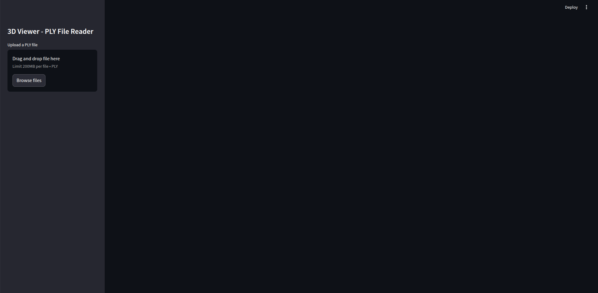
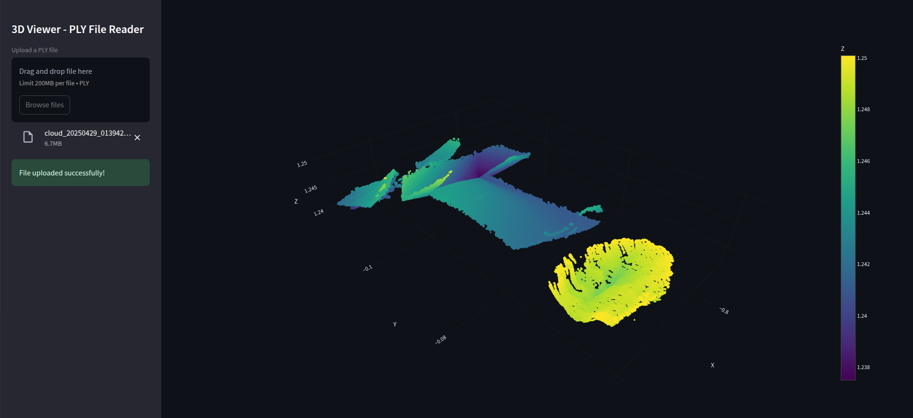

# 3DViewer
Welcome to the 3DViewer repository!
This project hosts a Python-based web application designed for easy visualization of various 3D point cloud files directly in your browser.

## ✨ Features

- 🟢 Supports `.ply`
- 🧭 First-person navigation for intuitive 3D exploration

## 📷 Screenshots
### Home Page


### Point Cloud visualized


## 🚀 Getting Started
The following needs to be accomplished to be able to run this on local web server.

### Prerequisites
- Python version `3.11.2`

  The next steps might be optional if you already have an virtual environment.
  
- Create a python environment
   ```bash
   python -m venv 3D_env
   ```
- Activate environment
  ```bash
   source 3D_env/bin/activate
   ```

### Installation

Clone the repository
```bash
git clone https://github.com/rahulhirur/3DViewer.git
```

Install dependency using requirement.txt
```bash
pip install -r requirements.txt
```

### Execution

There are two ways to get thing running

```bash
python main.py
```

or 

```bash
streamlit run app.py
```

This would generally start the web server and launch the the web app.


If the web page is not launched, then the local web server link is generally provided as an output of the above script.

